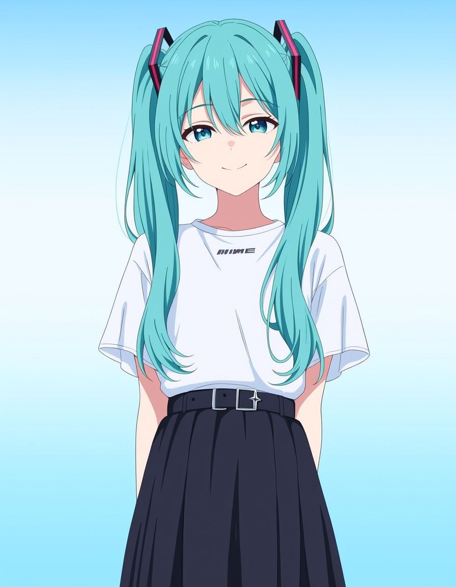

# SD Forge Mod Guidance
This is an Extension for [Forge Neo](https://github.com/Haoming02/sd-webui-forge-classic), which uses the good ol' **Clip** text encoder again for [Anima](https://huggingface.co/circlestone-labs/Anima) *(see [References](#references) for what this does)*

### Example

<table>
  <tr>
    <th>Off</th>
    <th>On</th>
  </tr>
  <tr>
    <td></td>
    <td></td>
  </tr>
</table>

- **Clip L:** https://huggingface.co/Anzhc/Noobai11-CLIP-L-and-BigG-Anime-Text-Encoders/tree/main

<details>
<summary>Infotext</summary>

```
masterpiece, best quality, good quality, absurdres, newest, (anime coloring, anime screenshot).
1girl, solo, hatsune miku, vocaloid, casual, looking at viewer, smile, simple background, gradient background
Negative prompt: score_9, score_1, score_2, score_3, blurry, jpeg artifacts, sepia, watermark, worst quality, low quality, large breasts, muscular, deformed hands, bad anatomy, extra limbs, poorly drawn face, mutated, extra eyes, bad proportions, character doll, chibi, old, early, censored, 3d, high contrast, ai-generated
Steps: 24, Sampler: ER SDE, Schedule type: Beta, CFG scale: 4, Shift: 3, Seed: 123, Size: 896x1152, Model hash: ed5e5bcdfa, Model: kirazuriAnima_v20AnimaPreview3, Module 1: qwen_3_06b, Module 2: Qwen2D_VAE, Clip skip: 2, RNG: CPU, Emphasis: No norm, Version: neo-2.23
```

</details>

<hr>

### References

- https://github.com/Anzhc/Anima-Mod-Guidance-ComfyUI-Node
- https://github.com/quickjkee/modulation-guidance
